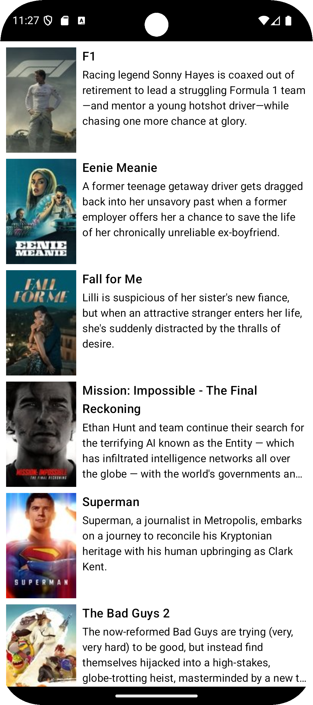

## Overview
A movies app that displays trending titles by consuming The Movie Database API (https://api.themoviedb.org). It implements pagination to provide users with an infinite scrolling experience and includes proper handling of specific errors, such as internet connectivity issues and server failures.

  

## Tech Stack
- Programming Language: Kotlin
- Clean Architecture
- UI: Android Jetpack Compose
- Dependency Injection: Koin
- Asynchronous requests: Coroutines + Retrofit + Gson
- Integration and Unit Tests
